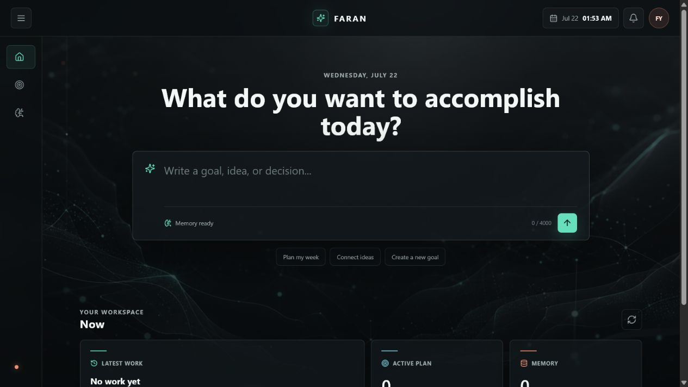
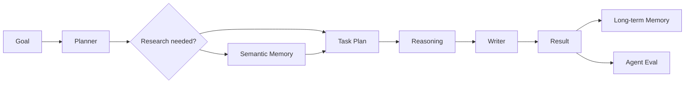

# FARAN AI



FARAN is a personal AI workspace that turns a goal into a grounded plan, ordered
tasks, durable execution state, and long-term memory. It combines a deterministic
offline runtime with a GPT-5.6 OpenAI Agents SDK runtime.

Built for OpenAI Build Week in the **Work & Productivity** track with Codex and
GPT-5.6. See the [Devpost submission copy](docs/DEVPOST_SUBMISSION.md),
[demo video script](docs/DEMO_VIDEO_SCRIPT.md), and
[Build Week technical package](docs/BUILD_WEEK.md).

## Product Flow



## Included

- FastAPI route/service/repository architecture
- GPT-5.6 Sol agent runtime through the Responses API and Agents SDK
- GPT-5.6 Luna structured note analysis
- Explicit reasoning effort, persisted reasoning context, response chaining,
  compaction, retry, and prompt-cache settings
- Planner, Workspace, Memory, Research, Reasoning, Writer, Task, and Tool agents
- Pydantic-validated function tools and optional allowlisted OpenAI connectors/MCP
- Semantic memory, local/OpenAI embeddings, SQLite vectors, and idea connections
- Durable queued workflows, polling, bounded retry, separate worker, and schedules
- Expert correction -> targeted regression case workflow
- Memory, retrieval, and agent-completion evaluations
- API-key authentication, trusted hosts, request limits, security headers, and JSON logs
- Alembic migrations, Docker API/worker services, CI, and pytest coverage
- Usable Build Week workspace at `/demo`

## Local Setup

```powershell
cd C:\Users\yolcu\Desktop\faran-ai\backend
.\venv\Scripts\python.exe -m pip install -r requirements-dev.txt
.\venv\Scripts\python.exe -m alembic upgrade head
.\venv\Scripts\python.exe -m uvicorn app.main:app --host 127.0.0.1 --port 8000 --reload
```

For queued and scheduled workflows, use a second terminal:

```powershell
cd C:\Users\yolcu\Desktop\faran-ai\backend
.\venv\Scripts\python.exe -m app.worker
```

Open:

- Workspace: http://127.0.0.1:8000/demo
- API docs: http://127.0.0.1:8000/docs
- Health: http://127.0.0.1:8000/health

## OpenAI Configuration

Copy `backend/.env.example` to `backend/.env`. For the production OpenAI path set:

```dotenv
AI_PROVIDER=openai
AGENT_RUNTIME=openai
OPENAI_API_KEY=...
OPENAI_MODEL=gpt-5.6-sol
OPENAI_ANALYSIS_MODEL=gpt-5.6-luna
OPENAI_REASONING_EFFORT=high
OPENAI_REASONING_CONTEXT=all_turns
```

`conversation_id` enables Responses API continuation through persisted
`previous_response_id`. Stable prompts use GPT-5.6 implicit prompt caching. The
deterministic runtime remains available for offline development.

Connected apps and remote MCP servers are disabled by default. They are exposed
only when an authorization value and explicit read-only tool allowlist are set.
Do not allow write tools until an approval/resume UX exists.

## Core API

- `POST /agent/run`: synchronous agent workflow
- `POST /agent/workflows`: durable API-triggered asynchronous workflow
- `GET /agent/workflows/{id}`: workflow status and result
- `POST /agent/workflows/{id}/retry`: bounded retry
- `POST /agent/schedules`: one-time or recurring trigger
- `GET /memory/`: long-term memory timeline
- `POST /retrieval/search`: semantic retrieval
- `GET /evaluations/agent/{id}`: completion contract eval
- `POST /evaluations/feedback`: correction-to-regression capture

## Production

```powershell
docker compose up --build
```

Production startup fails unless debug and automatic table creation are disabled,
trusted hosts are explicit, API auth is enabled, and selected provider credentials
are present. SQLite uses WAL and a busy timeout for the single-workspace API/worker
deployment. Move to PostgreSQL plus a dedicated vector store before multi-user or
multi-replica deployment.

## Verification

```powershell
cd C:\Users\yolcu\Desktop\faran-ai\backend
.\venv\Scripts\python.exe -m pytest
.\venv\Scripts\python.exe -m alembic upgrade head
```

A real OpenAI smoke test still requires a valid `OPENAI_API_KEY`; mocked tests do
not prove model availability, account entitlements, connector OAuth, or billing.
See [Build Week package](docs/BUILD_WEEK.md) and [architecture](docs/ARCHITECTURE.md).
