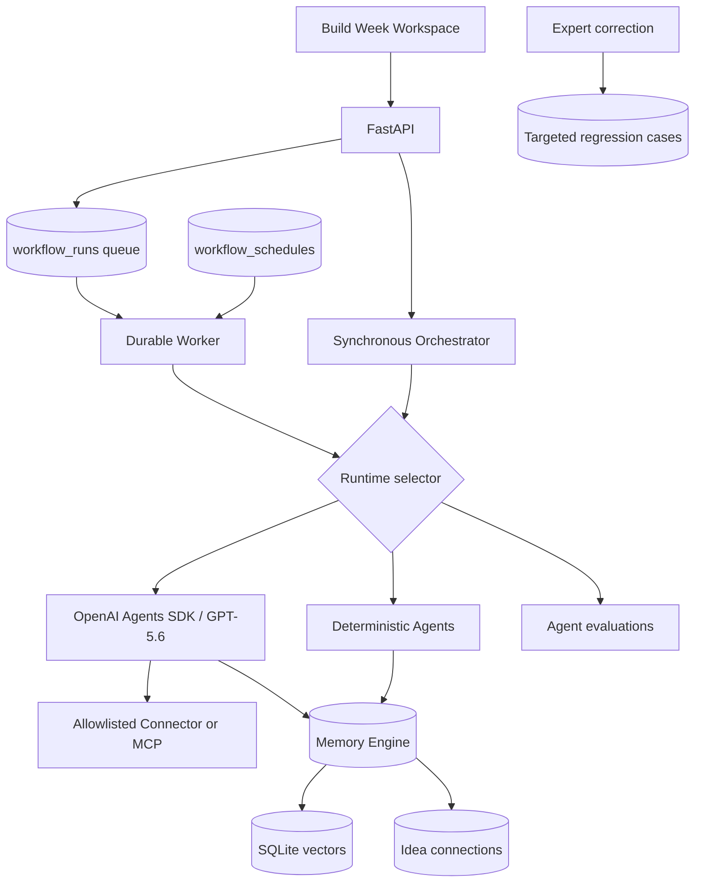

# FARAN Architecture

## Runtime Topology

## Layers

- `app/api`: HTTP validation and response contracts
- `app/services`: application use cases, workflow scheduling, evaluation
- `app/agents`: deterministic and OpenAI agent orchestration
- `app/ai`: provider and GPT-5.6 model settings
- `app/tools`: validated internal function-tool registry
- `app/memory`: memory normalization, embeddings, and connections
- `app/repositories`: SQLAlchemy persistence boundaries
- `app/models`: durable state
- `app/prompts`: stable model instructions
- `app/core`: settings, security, logging, middleware, database

## GPT-5.6 Runtime

The quality-critical agent runtime uses `gpt-5.6-sol`. Note extraction uses
`gpt-5.6-luna` with strict JSON Schema output. Agent calls explicitly configure
reasoning effort, `reasoning.context=all_turns`, server-side storage, automatic
context compaction, prompt caching, retries, and parallel tool calls.

Conversation continuity is keyed by a validated client `conversation_id`. FARAN
stores each `last_response_id` and supplies it as `previous_response_id` on the next
turn. This preserves compatible reasoning without replaying incomplete transcripts.

## Agent Graph

Planner hands execution to the Workspace Agent. Workspace calls Memory, Research,
Reasoning, and Writer specialists as tools and returns `OpenAIWorkflowOutput`.
The application then persists the result, tasks, completion criteria, trace summary,
and long-term memory in one transaction.

The deterministic runtime follows Planner -> conditional Research -> Task -> Memory
-> Reasoning -> Writer and implements the same public response contract.

## Durable Work

`POST /agent/workflows` records a queued workflow before execution. A local
BackgroundTask provides fast demo execution; `python -m app.worker` is the durable
recovery path. Workers atomically claim rows, update attempts, and preserve failures.
Schedules create queued runs through the same path, avoiding a second execution model.

## Security Boundary

Production configuration validates credentials, host allowlists, authentication,
debug settings, migrations, connector authorization, and explicit tool allowlists.
Remote MCP/connectors are disabled by default. FARAN does not expose shell or Computer
Use because no permissioned user action currently requires them.

## Evaluation Loop

Memory smoke checks, labeled retrieval hit-rate/MRR, and workflow completion contracts
are available through `/evaluations`. Expert corrections are stored against a workflow
and converted into bounded regression cases plus scoped engineering tasks.

## Scale Boundary

SQLite with WAL supports FARAN's current single-workspace API and worker. It is not a
multi-tenant or multi-replica claim. PostgreSQL, a shared queue, tenant isolation, and
an indexed vector store are required before horizontal scale.
